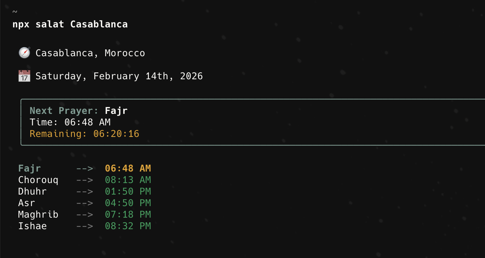

# 🧭 salat

> Daily Moroccan prayers time, right in your console, at the tip of your fingers. ✨

A modern, visually rich CLI for checking prayer times in Morocco, built with **React** and **Ink**.

[](https://www.npmjs.com/package/salat)
[](https://opensource.org/licenses/MIT)
[](https://codecov.io/gh/kafiln/salat-cli)

---

## 🚀 Features

- **Live Countdown**: "Remaining" time updates every second in real-time.
- **Hijri Date**: Display the current Hijri date alongside Gregorian dates.
- **Rich UI**: Beautiful terminal interface with colors and borders.
- **Morocco Focused**: Supports 320+ cities across Morocco.
- **Smart Caching**: In-memory caching with React Query to minimize API calls.
- **Developer Friendly**: Built with TypeScript, Commander.js, and React.

## 📦 Installation

```bash
npm install -g salat
```
or using npx 

```bash
npx salat
```

## 🛠 Usage

Simply run `salat` to see prayer times for the default city (Marrakech), or specify a city.

```bash
# Get prayer times for the default city
salat

# Get prayer times for a specific city
salat times Rabat

# Run once and exit (no live timer)
salat times Casablanca -1

# Get the current hijri date
salat hijri

# Show a rich visual guide
salat guide

# List all available cities
salat cities
```

### CLI Help

```text
Usage: salat [options] [command]

Daily Moroccan prayers tim  output the version number
  -h, --help                display help for command

Commands:
  times [options] [city]    Get prayer times for a city
  hijri                     Display the current hijri date
  guide                     Show a rich visual guide to using salat-cli
  cities                    Display the list of available city names
  help [command]          display help for command
```

## 📸 Screenshots



## 🏗 Dependencies

This project is built on the shoulders of giants:
- [**Commander.js**](https://github.com/tj/commander) - The complete solution for node.js command-line interfaces.
- [**Ink**](https://github.com/vadimdemedes/ink) - React for interactive command-line apps.
- [**React Query**](https://tanstack.com/query/latest) - Data synchronization library for managing server state.
- [**date-fns**](https://date-fns.org/) - Modern JavaScript date utility library.

## 🤝 Contributing

Contributions are welcome! Whether it's a bug fix, a new feature, or better documentation.

1.  **Fork** the project.
2.  **Clone** your fork: `git clone https://github.com/kafiln/salat-cli.git`
3.  **Install** dependencies: `npm install`
4.  **Live Development**: `npm run dev`
5.  **Build**: `npm run build`
6.  **Test**: `npm test`
7.  **Submit** a Pull Request.

## Todo
[] i18n (right now english is default)
[] Random Du'a generation
[] Random Aya generation


## ⭐ Show your support

If this project helped you, please consider giving it a **Star** on GitHub! It means a lot.

---

Built with ❤️ by [Kafil NASDAMI](https://github.com/kafiln)
