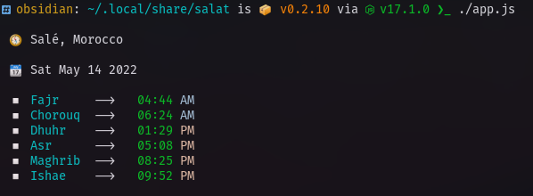
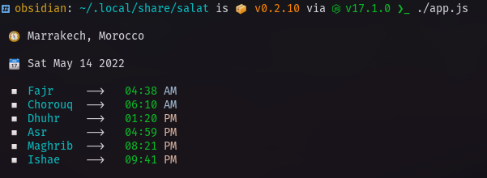
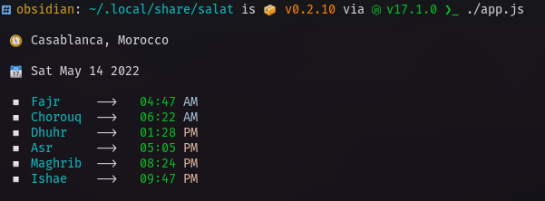

# Salat [](https://badge.fury.io/js/salat)

PLEASE SUPPORT THIS REPO WITH A STAR ⭐🌟💫

## Description

> Daily prayer time in all the cities in [Morocco](https://www.google.com/search?q=morocco) , directly in your terminal, at the tip of your fingers

**A stupid simple Command line utility to get the daily prayers time for all the citiy in Morocco**

The source of the data is [the Moroccan Ministery Website](http://www.habous.gov.ma)

## Getting started

```bash
npx salat [cityName]
```

Please note that if the cityName contains space of `'` you need to use quotes, example

```bash
npx salat "el jadida"
npx salat "L'msid"
```

## City List

This is an exhaustive list of the supported cities :

- Agadir
- Ahfir
- Ain Aouda
- Aïn Chaïr
- Ait El Kak
- Ait Ourir
- Akayouar
- Akdal Amelchil
- Akdez
- Akhefnir
- Akka
- Aknoul
- Akoudal Amelchil Midelt
- Amkala
- Amsmrir
- Araich
- Arbaoua
- Arfoud
- Asa
- Askin
- Asoul
- Assila
- Azemmour
- Azilal
- Azrou
- Bab Bared
- Ben Ahmed
- Ben Slimane
- Bengrir
- Beni Adrar
- Beni Ansar
- Beni Mellal
- Beni Tejit
- Berkane
- Berrchid
- Bir Anzaran
- Bir Kandour
- Bouanan
- Bouarfa
- Bouikra
- Bouizkaren
- Boujdour
- Boukrae
- Boulmane
- Boumalen Dadas
- Bourd
- Bouskoura
- Bouznika
- Casablanca
- Chefchaouan
- Chichaoua
- Dakhla
- Debdou
- Demnat
- Deryouche
- El Brouj
- El Gara
- El Hajeb
- El Jabha
- El Jadida
- El Kasba
- El Mahbes
- El Menzel
- Enif
- Erich
- Errachidia
- Essaouira
- Ezak
- Fem Lehsan
- Fem Zkid
- Ferkhana
- Fes
- Fezouane
- Figuig
- Fnideq
- Fquih Ben Salah
- Geltat Zamour
- Guelmim
- Guercif
- Hoceima
- Igherem
- Ikes
- Imelchil
- Imin Telat
- Imntanout
- Imouzzer Kandar
- Jerada
- Kalaat Megouna
- Kalaat Sraghna
- Kares
- Kariat Ba Mohammed
- Kasbah Tadla
- Katara
- Kelmima
- Kénitra
- Ketama
- Khemis Sidi Abd Jelil
- Khemis Zemamra
- Khémissat
- Khenifra
- Khouribga
- Ksar El Kebir
- Ksar El Sghir
- Ksar Ich
- L'msid
- Laayoune
- Laayoune Sidi Mellouk
- Lagouira
- Marrakech
- Martil
- Mediek
- Meknes
- Melilla
- Meskoura
- Metmata
- Midelt
- Misour
- Mohammedia
- Moulay Bouaza
- Moulay Bousselham
- Moulay Yacoub
- Nador
- Oualidia
- Ouazane
- Oued Amlil
- Oued Law
- Oued Zam
- Oujda
- Oulad Ayad
- Oulad Tayma
- Oulmes
- Ourzazate
- Ousered
- Rabat
- Ras Alma
- Remani
- Rhamna
- Ribate El Kheir
- Risani
- Safi
- Saïdia
- Sebta
- Sefrou
- Selouane
- Settat
- Sidi Benour
- Sidi Ghanem
- Sidi Ifni
- Sidi Kacém
- Sidi Slimane
- Sidi Yahya Gharb
- Smara
- Souq Arbiâ Gharb
- Tafntan
- Tafougalt
- Tafraouet
- Tahla
- Tahla
- Talouine
- Talsint
- Tamslouhet
- Tanger
- Tantan
- Taounat
- Taourirt
- Tarfaya
- Taroudant
- Tasltanet
- Tata
- Taza
- Tazarin
- Tefariti
- Temnar
- Tendrara
- Tenghir
- Tenjedad
- Tetouan
- Tiflet
- Tindit
- Tisa
- Tisenet
- Tizi Ousli
- Tiznit
- Toulkoult
- Yefrin
- Yousofia
- Zagoura
- Zaouiat Ahansal
- Zaouiat Moulay Ibrahim
- Zayou
- Zerhoune

Alternatively You can also install it globally

```bash
# Install

$ npm i -g salat

# Run with default city

$ salat

# Run with custom city

$ salat [cityName]
```

## Output

```bash
# The programs prints to the console the prayers' time for the current day in the default city as shown bellow:
```





## Change the default city

- The default city is :heart: [Marrakech](https://www.google.com/search?q=marrakech) :heart:, set as a value for the `DEFAULT_CITY` variable in `./constants.js`

- You can change it by replacing `Marrakech` by your city name according to the values from `./data/cities.json`

## Help

- Please keep in mind that this is a work in progress in a very early stages, any help is appreciated and more than welcome.

- If you think this piece of code is anyhow useful, please feel free to `contribute`, `star` :star::star: and `share` 🙏 🙏

## Todo

- [x] Use a default city
- [x] Use localstorage-like api for caching purposes
- [ ] Improve performance
- [ ] Add unit tests
- [x] Add a documentation site
- [ ] Command to set the default city
- [ ] Command to display the list of available cities
- [ ] Command to display the time table for the whole month

## License

This project is under the MIT license.

### Built With 💖 in Ramadan
