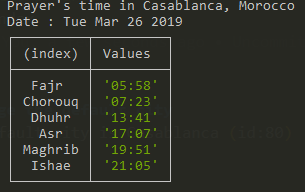
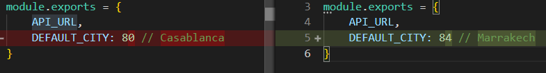

# Description

## Daily prayer time in all the cities in Morocco, directly in your terminal , at the tip of your fingers

A stupid simple Command line utility to get the daily prayers time for all the citiy in Morocco

The source of the data is [the Moroccan Ministery Website](http://www.habous.gov.ma)

## Getting started

```bash
# Install

$ npm i -g salat

# Run with default city

$ salat

# Run with custom city

$ salat [cityName]
```

`City name should be provided the same way it's written in the cities.json`

## Output

```bash
# The programs prints to the console the prayers' time for the current day in the default city as shown bellow:
```



## Dependecies

The code behind depends on :

- `[axios](https://github.com/axios/axios)` to make an http request ( fetch the data).
- `[jsdom](https://github.com/jsdom/jsdom)` to parse the html result.
- `[chalk](https://github.com/chalk/chalk)` to avoid boring styles and colors.
- `[node-localstorage](https://github.com/lmaccherone/node-localstorage)` to read and write from localstorage.

## Change the default city

- The default city is `Marrakech`, set as a value for the variable `DEFAULT_CITY` in `./constants.js`

- You can change it by replacing `Marrakech` by the values from `./data/cities.json`



# Help

Please keep in mind that this is a work in progress in a very early stages, any help is appreciated and more than welcome.

# Todo

- Command to set the default city
- Command to display the list of available cities

Show your support ==> Star the repo
If you think this is not a useless piece of code
